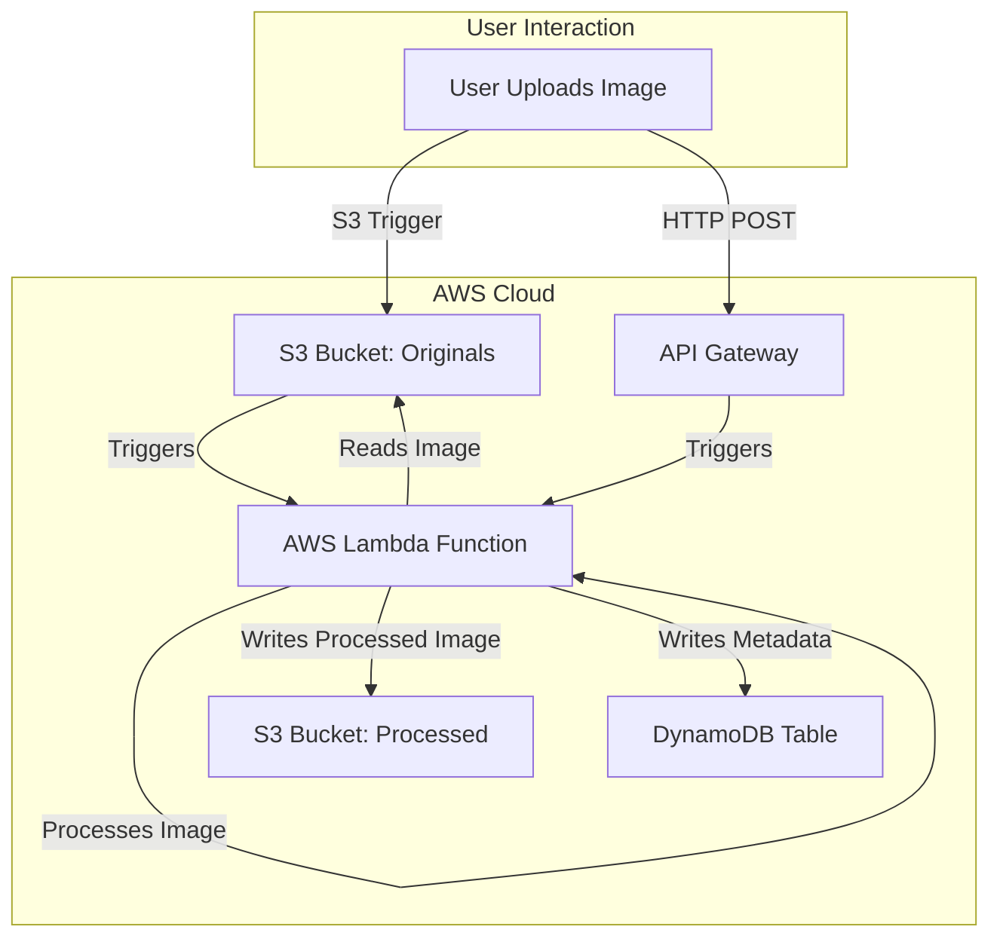

# Serverless Image Processing App

This project is a complete serverless image processing pipeline on AWS. It allows users to upload images, which are then automatically processed (resized, watermarked) and stored, with metadata tracked for each image.

## End-to-End Project Process

1. **User Uploads Image**
	- Users can upload images either directly to the S3 bucket (`original-images`) or via the REST API endpoint (API Gateway).

2. **Event Trigger**
	- Uploading an image to the S3 bucket triggers the Lambda function automatically.
	- Alternatively, uploading via the API Gateway triggers the same Lambda function.

3. **Image Processing (Lambda Function)**
	- The Lambda function downloads the image, resizes it to 512x512 pixels, and adds a watermark.
	- The processed image is uploaded to a separate S3 bucket (`processed-images`).
	- Metadata (image ID, timestamp, source) is stored in DynamoDB.

4. **Storage and Access**
	- Original images are stored in the `original-images` S3 bucket.
	- Processed images are stored in the `processed-images` S3 bucket.
	- Metadata is available in the DynamoDB table for tracking and querying.

5. **Security**
	- IAM roles and S3 bucket policies ensure least-privilege access for Lambda and other AWS services.

## Architecture Overview

- **Amazon S3**: Stores original and processed images
- **AWS Lambda**: Processes images (resize, watermark)
- **Amazon API Gateway**: Exposes an API for uploads
- **Amazon DynamoDB**: Stores image metadata

## Flowchart

The following Mermaid diagram describes the end-to-end flow. You can copy this code into Lucidchart (Insert > Mermaid) to generate a downloadable diagram:




## Getting Started

To deploy and run this project, follow these steps. For more detailed instructions, see `docs/DEPLOYMENT.md`.

### Prerequisites
- **AWS Account**: You will need an AWS account to deploy the resources.
- **AWS CLI**: The AWS Command Line Interface must be installed and configured with your credentials.
- **AWS SAM CLI**: The AWS Serverless Application Model (SAM) CLI is required to build and deploy the application.
- **Python**: Python 3.8 (or the version specified in `infrastructure/template.yaml`) must be installed.

### Deployment Process
1. **Clone the Repository**:
   ```bash
   git clone https://github.com/trivikramm/serverless-image-processing-app.git
   cd serverless-image-processing-app
   ```

2. **Build the Application**:
   Navigate to the `infrastructure` directory and run the `sam build` command. This command bundles the Lambda function code and its dependencies.
   ```bash
   cd infrastructure
   sam build
   ```

3. **Deploy to AWS**:
   Run the `sam deploy --guided` command. This will walk you through the deployment process, prompting you for parameters like a Stack Name and AWS Region.
   ```bash
   sam deploy --guided
   ```
   After a successful deployment, the AWS CloudFormation outputs will display the names of your S3 buckets and the API Gateway endpoint URL.

4. **Test the Application**:
   You can now test the pipeline in two ways:
   - **S3 Trigger**: Upload an image file directly to the `original-images` S3 bucket in the AWS console.
   - **API Gateway**: Send a POST request to the API endpoint with a JSON body containing a base64-encoded image.

   In both cases, the processed image will be saved in the `processed-images` S3 bucket, and a new entry will be created in the DynamoDB table.
