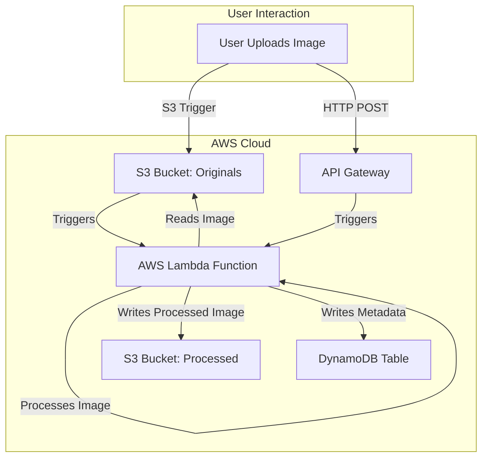

# Serverless Image Processing App

This project is a complete serverless image processing pipeline on AWS. It allows users to upload images, which are then automatically processed (resized, watermarked) and stored, with metadata tracked for each image.

## End-to-End Project Process

1. **User Uploads Image**
	- Users can upload images either directly to the S3 bucket (`original-images`) or via the REST API endpoint (API Gateway).

2. **Event Trigger**
	- Uploading an image to the S3 bucket triggers the Lambda function automatically.
	- Alternatively, uploading via the API Gateway triggers the same Lambda function.

3. **Image Processing (Lambda Function)**
	- The Lambda function downloads the image, resizes it to 512x512 pixels, and adds a watermark.
	- The processed image is uploaded to a separate S3 bucket (`processed-images`).
	- Metadata (image ID, timestamp, source) is stored in DynamoDB.

4. **Storage and Access**
	- Original images are stored in the `original-images` S3 bucket.
	- Processed images are stored in the `processed-images` S3 bucket.
	- Metadata is available in the DynamoDB table for tracking and querying.

5. **Security**
	- IAM roles and S3 bucket policies ensure least-privilege access for Lambda and other AWS services.

## Architecture Overview

- **Amazon S3**: Stores original and processed images
- **AWS Lambda**: Processes images (resize, watermark)
- **Amazon API Gateway**: Exposes an API for uploads
- **Amazon DynamoDB**: Stores image metadata

## Flowchart

The following Mermaid diagram describes the end-to-end flow. You can copy this code into Lucidchart (Insert > Mermaid) to generate a downloadable diagram:

## Getting Started

See `infrastructure/` for deployment instructions and `docs/DEPLOYMENT.md` for detailed steps.
